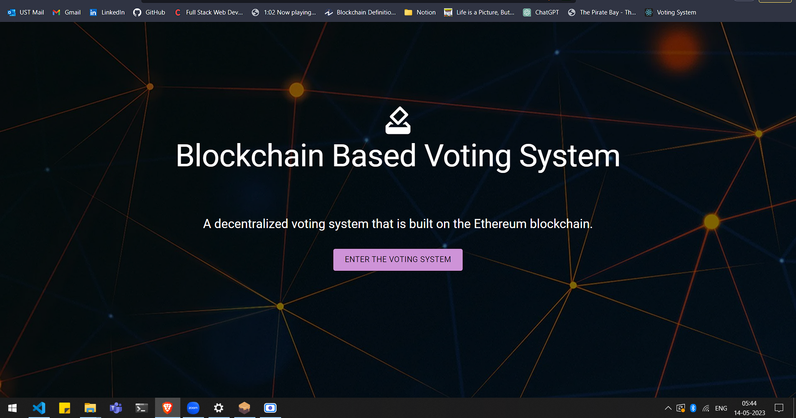
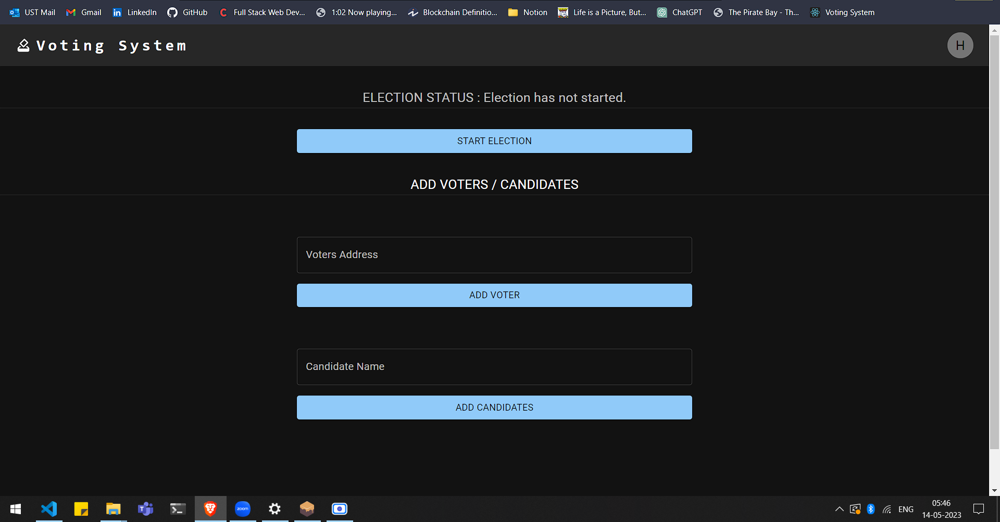
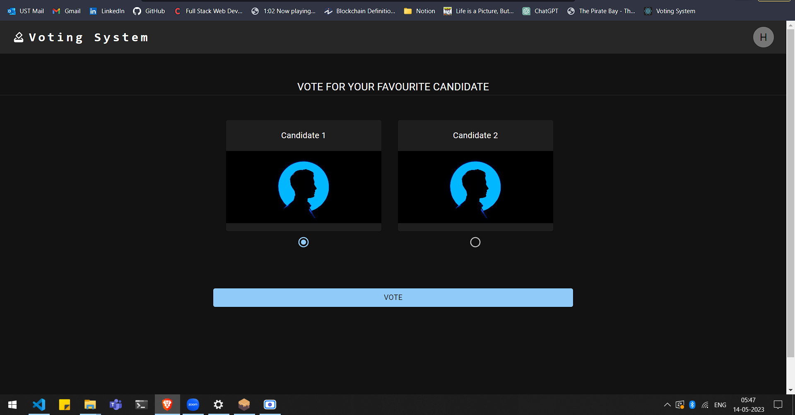
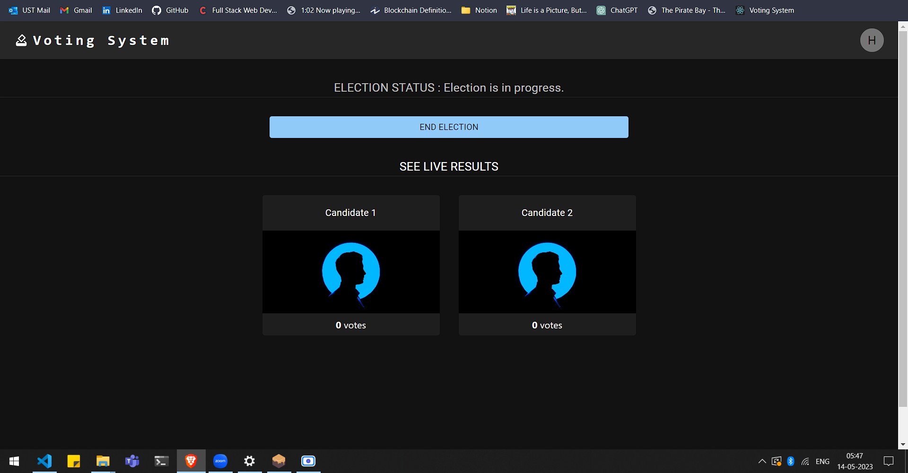
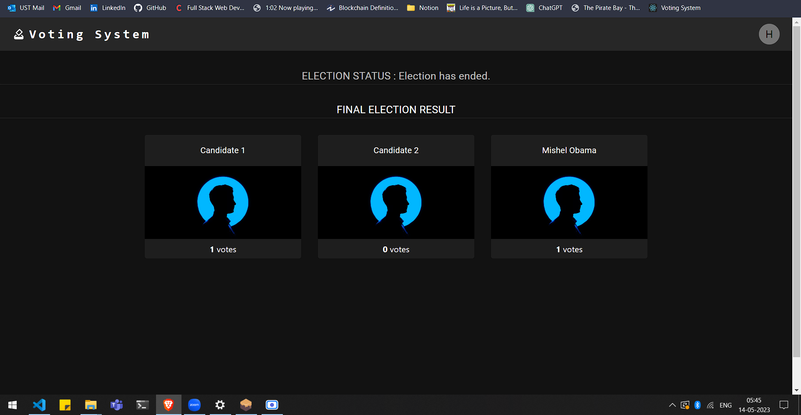

# Secure and Trustless Online Voting Platform with Blockchain Technology

This application is a blockchain-based online voting platform that utilizes the Ethereum
blockchain to create a tamper-proof ledger of votes, increasing transparency, reducing the
potential for voter fraud, and improving public trust in the democratic process.
The system is built using Solidity and React, and allows eligible voters to cast their vote
securely and easily from anywhere in the world. By leveraging the benefits of blockchain
technology, the system has the potential to revolutionize the way voting is conducted not
only in traditional elections but also in corporate board meetings, academic committee
elections, and community initiatives.
The significance of this application lies in the fact that the traditional voting process is
fraught with challenges that can undermine the legitimacy of election results and reduce
public trust in the democratic process. This system provides a fast, efficient, and low-cost
alternative to traditional voting systems, while also ensuring the privacy and security of
voters' information. By using smart contracts to automate the counting and verification of
ballots, the proposed system creates a decentralized, trustless voting process that is
transparent and auditable, thus improving the integrity and trustworthiness of elections.
## Screenshots

 &nbsp;
 &nbsp;
 &nbsp;
 &nbsp;
 &nbsp;
## Installation

1. Clone the project & open in it VS code: git clone https://github.com/Kerala-Blockchain-Academy/project-submission-HashirAKB.git
2. Download and install ganache from https://trufflesuite.com/ganache/
3. Open ganache and start your local ganache blockchain instance.
4. Open your browser install metamask wallet client, connect your local ganache instance, and import the accounts.
5. Goto the project opened in VS code and make sure the development network configured (line 69) in the "truffle-config.js" matches with your local ganache instances configuration.
6. We need Node.js and Truffle framework to run this voting dApp. Install both if it is not present in your system.
7. Install Node.js: https://nodejs.org/en/download
8. Install truffle framework: npm install truffle -g
9. Open the project folder in a terminal. Install node modules using command npm install.
10. Compile and deploy the smart contract by using the command 'truffle migrate reset --network development'. We must migrate the election smart contract each time restart ganache.
11. From terminal, move to the client folder using 'cd client'. Install node modules using command 'npm install'.
12. Run the frontend using the command 'npm start'.
13. Visit URL in your browser: http://localhost:3000
## Execution Flow (Admin)

1. User opens the Home page.
2. Opens metamask wallet client and connect with the admin account. (Admin account: Account which deployed the smart contract.)
3. Entering the voting system.
4. In the admin page, admin can control the election procedures. Other users/accounts do not have the privilege to access this screen.
5. Admin user can start or end the election, add voters and candidates.
6. Admin registers a few voters by inputing their public addresses.
7. Admin registers candidate by inputing candidate names.
8. Admin starts the election, The state of election changes to inProgress.
9. Admin ends the election after votes are casted.
10. Final results are displayed.
## Execution Flow (Voter)

1. User opens the Home page.
2. Opens metamask wallet client and connect with the voter account. (Voter account: Accounts which registered by admin as voters.)
3. Entering the voting system.
4. If the account is not registered as a voter account, system displayes as "Unauthorised user".
5. The voting window opens for the voter only if the election state is in progress, else it displays 'Election is not started yet' or 'Election ended' as per the current state.
6. In the voting window, voter can see the list of candidates.
7. Voter cast the votes.
8. The results will be displayed to the voter after election is over.

# CED-Project

## Check List

- [x] Web Application (Code should be commented)  
- [x] Smart Contract(s) (Code should be commented)  
- [x] Test File(s) (Test cases should be commented)  
- [x] Working Demo of Application (A video or screen recording of the flow and functionalities of the application)  
- [x] Pitch Deck (PDF).  
- [x] Public Test network Deployment details (TXT).  
  - [x] Verify the contract  
  - [x] Contract Address  
  - [x] Network Name  
- [x] Readme file (Readme.md)  
  - [x] Step-by-step instructions for setting up the application for use.  
  - [x] Complete execution flow of the dApp  
- [x] Design Document file (PDF)  
  - [x] Project Proposal (Title, Problem Statement, Proposed System, Existing System, Need for Ethereum Blockchain).  
  - [x] Rough and neat workflow diagram of the decentralized application.  
  - [x] Smart contract logic process flow diagram.  
  - [x] Shortcomings and future enhancements.  
